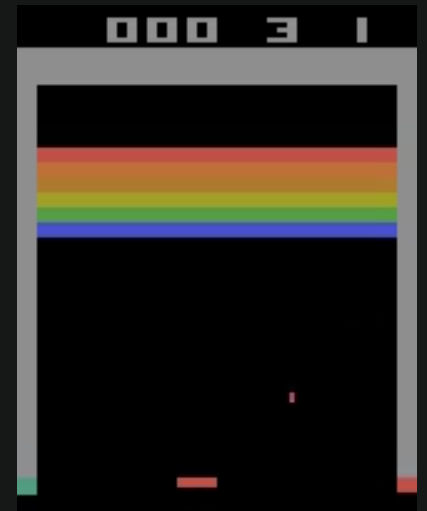

# DQN for Atari Breakout

This file contains all the necessary code and configuration files to create the `dqn-breakout` project, all in one place for easy copying.

## 📄 README.md

# DQN for Atari Breakout

This repository contains a PyTorch implementation of a Deep Q-Network (DQN) agent that learns to play the Atari game Breakout. This project was built by following the original DeepMind paper, using a Convolutional Neural Network (CNN) to learn directly from pixel inputs.



## 🚀 Features

* **Deep Q-Network (DQN):** Uses a CNN to approximate the Q-function.
* **Experience Replay:** Implements a Replay Buffer to store and sample transitions, de-correlating experiences.
* **Target Network:** Uses a separate, "frozen" target network to stabilize Q-value targets.
* **Gymnasium Wrappers:** Includes a custom environment wrapper to preprocess observations (grayscale, resize, and frame stacking) for efficient learning.

## 📁 Project Structure

Here is the layout of the repository:

dqn-breakout/

├── .gitignore
├── README.md
├── requirements.txt
├── dqn_agent.py
├── env_utils.py
├── main.py

## 🛠️ Setup

Follow these steps to get the project running on your local machine.

1.  **Clone the repository:**
    ```bash
    git clone [https://github.com/Karl-0-1/dqn-breakout.git](https://github.com/Karl-0-1/dqn-breakout.git)
    cd dqn-breakout
    ```

2.  **Create a virtual environment (Recommended):**
    ```bash
    python -m venv venv
    source venv/bin/activate  # On Windows: venv\Scripts\activate
    ```

3.  **Install dependencies:**
    ```bash
    pip install -r requirements.txt
    ```
    
4.  **Install Git LFS (for the model file):**
    
    The pre-trained model file (`.pth`) is large and tracked using Git Large File Storage (LFS).
    
    * [Download and install Git LFS](https://git-lfs.github.com/).
    * Run `git lfs install` (only once per machine).
    * Pull the model file: `git lfs pull`


## 🏃 How to Run

You can either train the agent from scratch or watch the pre-trained agent play.

### To Train
To train a new model from scratch:
```bash
python main.py --mode train
```
### To Watch (Play)
To watch the trained agent play (this will generate an .mp4 file in a new videos/ folder):

```bash

python main.py --mode play
